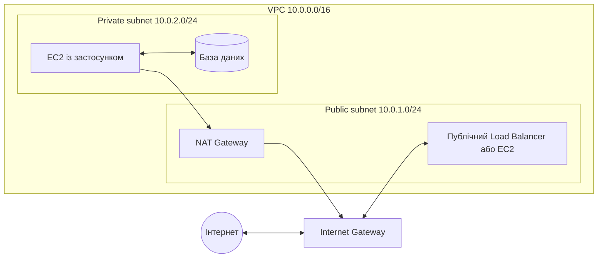

# Amazon VPC: підмережі, маршрути та шлюзи

Цей матеріал пояснює, як у AWS побудована базова мережа та як пов’язані між собою:

- **VPC**;
- **public і private subnets**;
- **route tables**;
- **Internet Gateway**;
- **NAT Gateway**.

## 1. Загальна картина

Уявімо VPC як приватну територію компанії:

- **VPC** — уся територія;
- **subnet** — окрема зона на цій території;
- **route table** — дорожні вказівники, які визначають напрямок руху;
- **Internet Gateway** — ворота між VPC та інтернетом;
- **NAT Gateway** — контрольований виїзд в інтернет для ресурсів, які не повинні приймати прямі вхідні з’єднання.

Типова архітектура має такий вигляд:



У цій схемі:

- публічний ресурс може обмінюватися трафіком з інтернетом через Internet Gateway;
- приватний EC2 може сам ініціювати вихід в інтернет через NAT Gateway;
- інтернет не може розпочати пряме з’єднання з приватним EC2 через NAT Gateway;
- база даних може працювати лише всередині VPC і взагалі не мати маршруту до інтернету.

---

## 2. VPC — Virtual Private Cloud

**Amazon VPC** — це логічно ізольована віртуальна мережа в AWS, яку створює та налаштовує користувач.

Під час створення VPC задають діапазон IP-адрес у форматі **CIDR**, наприклад:

```text
10.0.0.0/16
```

Такий блок містить адреси від `10.0.0.0` до `10.0.255.255` — усього 65 536 IPv4-адрес. Не всі адреси можна призначити ресурсам: у кожній subnet AWS резервує п’ять IPv4-адрес.

VPC належить одному **AWS Region**, але може містити підмережі в кількох **Availability Zones** цього регіону.

У VPC можна розміщувати:

- EC2 instances;
- load balancers;
- бази даних RDS;
- Lambda functions із підключенням до VPC;
- NAT gateways;
- інші мережеві ресурси AWS.

### Приклад плану адрес

| Ресурс | CIDR | Призначення |
|---|---|---|
| VPC | `10.0.0.0/16` | Уся мережа |
| Public subnet A | `10.0.1.0/24` | Публічні ресурси в AZ A |
| Private subnet A | `10.0.11.0/24` | Приватні ресурси в AZ A |
| Public subnet B | `10.0.2.0/24` | Публічні ресурси в AZ B |
| Private subnet B | `10.0.12.0/24` | Приватні ресурси в AZ B |

CIDR підмереж не повинні перетинатися та мають бути частиною CIDR-блоку VPC.

---

## 3. Subnet — підмережа

**Subnet** — це частина діапазону IP-адрес VPC. Кожна subnet повністю розташована лише в **одній Availability Zone**.

Розміщення підмереж у двох або більше Availability Zones дає змогу створювати відмовостійкі системи.

### Public subnet

Підмережа є **public**, якщо пов’язана з route table, у якій є прямий маршрут до Internet Gateway:

| Destination | Target |
|---|---|
| `10.0.0.0/16` | `local` |
| `0.0.0.0/0` | `igw-...` |

`0.0.0.0/0` означає всі IPv4-адреси, для яких немає точнішого маршруту.

Важливо: маршрут до Internet Gateway робить **підмережу** публічною, але не робить кожен ресурс у ній автоматично доступним з інтернету. Для EC2 також потрібні:

- public IPv4 address або Elastic IP;
- дозвіл у Security Group;
- дозвіл у Network ACL, якщо її правила змінено;
- запущений сервіс, який слухає потрібний порт.

У public subnet зазвичай розміщують:

- internet-facing load balancer;
- bastion host, якщо він справді потрібен;
- зональний public NAT Gateway;
- публічний вебсервер у простих навчальних архітектурах.

### Private subnet

Підмережа є **private**, якщо її route table **не має прямого маршруту до Internet Gateway**.

Типова route table приватної підмережі з виходом в інтернет через NAT Gateway:

| Destination | Target |
|---|---|
| `10.0.0.0/16` | `local` |
| `0.0.0.0/0` | `nat-...` |

У private subnet зазвичай розміщують:

- application servers;
- worker nodes;
- внутрішні сервіси;
- бази даних.

Приватна підмережа може:

- спілкуватися з іншими підмережами VPC через маршрут `local`;
- виходити в інтернет через NAT Gateway;
- використовувати VPC endpoints для приватного доступу до підтримуваних AWS services;
- не мати доступу до інтернету взагалі.

> **Головна ідея:** public чи private — це властивість маршрутизації subnet, а не її назви.

---

## 4. Route Table — таблиця маршрутів

**Route table** — це набір правил, за якими VPC router визначає, куди передати мережевий пакет.

Кожен маршрут має дві головні частини:

- **Destination** — адреса або діапазон призначення;
- **Target** — ресурс, через який потрібно відправити трафік.

Приклад:

| Destination | Target | Значення |
|---|---|---|
| `10.0.0.0/16` | `local` | Трафік усередині VPC |
| `0.0.0.0/0` | `igw-123...` | Увесь інший IPv4-трафік через Internet Gateway |

### Основні правила

1. Кожна subnet повинна бути пов’язана з однією route table.
2. Одна route table може бути пов’язана з кількома subnets.
3. Якщо subnet не пов’язали з custom route table явно, вона використовує **main route table** VPC.
4. У кожній route table є маршрут `local`, який забезпечує обмін трафіком усередині VPC.
5. Якщо підходять кілька маршрутів, використовується **найточніший**, тобто маршрут із найдовшим префіксом CIDR.

Наприклад, якщо таблиця містить:

```text
10.0.0.0/16  -> local
0.0.0.0/0    -> Internet Gateway
```

то пакет до `10.0.12.25` піде за маршрутом `local`, а пакет до `8.8.8.8` — через Internet Gateway.

> Route table визначає шлях трафіку, але не надає дозвіл на доступ. Дозволи контролюють, зокрема, Security Groups і Network ACLs.

---

## 5. Internet Gateway — доступ VPC до інтернету

**Internet Gateway (IGW)** — керований AWS компонент, який підключається до VPC та слугує ціллю маршруту для трафіку між VPC й інтернетом.

Для IPv4-доступу EC2 до інтернету через IGW потрібні одночасно:

1. Internet Gateway, підключений до VPC;
2. маршрут `0.0.0.0/0 -> igw-...` у route table subnet;
3. public IPv4 address або Elastic IP на EC2;
4. відповідні правила Security Group і Network ACL.

### Шлях вихідного трафіку з public subnet

```text
EC2 з public IP
    -> route table
    -> Internet Gateway
    -> інтернет
```

Internet Gateway підтримує і вхідні, і вихідні з’єднання, якщо їх дозволяють інші мережеві налаштування.

Для всього IPv6-трафіку використовується маршрут:

```text
::/0 -> igw-...
```

Маршрути IPv4 та IPv6 налаштовуються окремо.

---

## 6. NAT Gateway — вихід з private subnet

**NAT Gateway** виконує трансляцію мережевих адрес. Його типовий сценарій — дозволити ресурсам у private subnet ініціювати з’єднання з інтернетом, не відкриваючи можливість починати небажані з’єднання з інтернету до цих ресурсів.

Наприклад, приватному EC2 може бути потрібно:

- завантажити оновлення операційної системи;
- встановити пакет;
- звернутися до зовнішнього API.

### Класична схема із зональним public NAT Gateway

1. Public NAT Gateway створюють у **public subnet**.
2. Йому призначають **Elastic IP**.
3. Public subnet має маршрут `0.0.0.0/0 -> Internet Gateway`.
4. Private subnet має маршрут `0.0.0.0/0 -> NAT Gateway`.

Шлях трафіку:

```text
EC2 у private subnet
    -> private route table
    -> public NAT Gateway
    -> Internet Gateway
    -> інтернет
```

Відповідь повертається тим самим шляхом. Нове пряме з’єднання з інтернету через NAT Gateway до приватного EC2 розпочати не можна.

### Зональний і регіональний NAT Gateway

AWS підтримує два режими доступності NAT Gateway:

- **Zonal NAT Gateway** — працює в одній Availability Zone. Для високої доступності зазвичай створюють окремий NAT Gateway у кожній активній AZ і направляють кожну private subnet до NAT Gateway у тій самій AZ.
- **Regional NAT Gateway** — автоматично працює в кількох Availability Zones відповідно до розміщення навантаження. Він використовує один NAT Gateway ID для subnets у різних AZ і не потребує окремої public subnet для розміщення самого шлюзу.

У багатьох навчальних лабораторіях використовується класична **зональна** схема, тому важливо розуміти її маршрут `private subnet -> NAT Gateway -> Internet Gateway`.

### Важливі особливості NAT Gateway

- це керований AWS service;
- він не замінює Internet Gateway у класичній схемі доступу до публічного інтернету;
- він не призначений для приймання довільних вхідних з’єднань;
- за роботу NAT Gateway і оброблені ним дані стягується плата;
- для доступу лише до деяких AWS services дешевше й безпечніше може бути використати **VPC endpoint**, а не направляти трафік через NAT Gateway.

> Для вихідного IPv6-трафіку без дозволу на вхідні з’єднання зазвичай використовують **egress-only Internet Gateway**, а не звичайну IPv4 NAT-схему.

---

## 7. Порівняння Internet Gateway і NAT Gateway

| Ознака | Internet Gateway | NAT Gateway |
|---|---|---|
| Підключення | До VPC | Зональний — у subnet; регіональний — у VPC |
| Основна роль | З’єднання VPC з інтернетом | Трансляція адрес для вихідних з’єднань |
| Типова subnet | Public | Допомагає ресурсам із private subnet |
| Вхідні з’єднання з інтернету | Можливі за наявності public IP і дозволів | Не дозволяє розпочати довільне з’єднання до приватного ресурсу |
| Типовий маршрут | `0.0.0.0/0 -> igw-...` | `0.0.0.0/0 -> nat-...` |
| Оплата за сам gateway | Немає погодинної плати за IGW | Є плата за gateway та обробку даних |

---

## 8. Як визначити тип subnet

Не орієнтуйтеся лише на назву `public-subnet` або `private-subnet`. Перевірте route table, пов’язану з subnet.

### Якщо бачимо

```text
0.0.0.0/0 -> igw-...
```

це **public subnet**.

### Якщо бачимо

```text
0.0.0.0/0 -> nat-...
```

це **private subnet із вихідним IPv4-доступом** через NAT Gateway.

### Якщо бачимо лише

```text
10.0.0.0/16 -> local
```

це **ізольована private subnet** без маршруту до інтернету.

---

## 9. Типові помилки

### «Якщо EC2 розташований у public subnet, він автоматично доступний з інтернету»

Ні. Потрібні public IP, правильний маршрут, правила Security Group та інші коректні налаштування.

### «Public subnet визначається public IP її ресурсів»

Ні. Тип subnet визначається наявністю прямого маршруту до Internet Gateway.

### «NAT Gateway дозволяє підключитися з інтернету до private EC2»

Ні. NAT Gateway забезпечує вихідні з’єднання та повернення відповідей на них.

### «Достатньо створити NAT Gateway»

Ні. Необхідно також налаштувати маршрути. У класичній зональній схемі public NAT Gateway повинен мати шлях до Internet Gateway, а private subnet — маршрут до NAT Gateway.

### «Route table — це firewall»

Ні. Route table обирає шлях. Security Group і Network ACL контролюють, який трафік дозволено.

---

## 10. Приклад двошарового застосунку

Нехай потрібно розгорнути вебзастосунок:

- публічний Application Load Balancer приймає HTTPS-запити;
- EC2 instances із застосунком не повинні бути доступними напряму;
- застосунок іноді завантажує оновлення з інтернету.

Рішення:

1. Створити VPC `10.0.0.0/16`.
2. Створити public і private subnets щонайменше у двох Availability Zones.
3. Підключити Internet Gateway до VPC.
4. У public route table додати `0.0.0.0/0 -> Internet Gateway`.
5. Розмістити internet-facing load balancer у public subnets.
6. Розмістити EC2 із застосунком у private subnets без public IP.
7. Налаштувати для private subnets вихідний маршрут через NAT Gateway або потрібні VPC endpoints.
8. У Security Group EC2 дозволити вхідний трафік лише від Security Group load balancer.

Такий поділ зменшує кількість ресурсів, безпосередньо доступних з інтернету.

---

## 11. Що варто запам’ятати

```text
Public subnet  = прямий маршрут до Internet Gateway
Private subnet = немає прямого маршруту до Internet Gateway

Public resource:
ресурс -> Route Table -> Internet Gateway -> Internet

Private resource із виходом в інтернет:
ресурс -> Route Table -> NAT Gateway -> Internet Gateway -> Internet
```

Internet Gateway з’єднує VPC з інтернетом. NAT Gateway дає приватним ресурсам контрольований вихід назовні. Route Table визначає, яким шляхом піде трафік.

## Офіційна документація AWS

- [What is Amazon VPC?](https://docs.aws.amazon.com/vpc/latest/userguide/what-is-amazon-vpc.html)
- [VPC configuration options](https://docs.aws.amazon.com/vpc/latest/userguide/create-vpc-options.html)
- [Subnet route tables](https://docs.aws.amazon.com/vpc/latest/userguide/subnet-route-tables.html)
- [Internet gateways](https://docs.aws.amazon.com/vpc/latest/userguide/VPC_Internet_Gateway.html)
- [NAT gateways](https://docs.aws.amazon.com/vpc/latest/userguide/vpc-nat-gateway.html)
- [Regional NAT gateways](https://docs.aws.amazon.com/vpc/latest/userguide/nat-gateways-regional.html)
